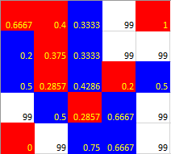

## Original Text
from http://nifty.stanford.edu/2014/mccown-schelling-model-segregation/
## Overview

Racial segregation has always been a pernicious social problem in the United States. Although much effort has been extended to desegregate schools, churches, and neighborhoods, the [US continues to remain segregated](http://tcf.org/blog/detail/racial-segregation-is-still-a-problem) by race and economic lines. Why is segregation such a difficult problem to eradicate?

In 1971, the American economist [Thomas Schelling](http://en.wikipedia.org/wiki/Thomas_Schelling) created an agent-based model that might help explain why segregation is so difficult to combat. His _model of segregation_ showed that even when individuals (or "agents") didn&#39;t mind being surrounded or living by agents of a different race, they would still _choose_ to segregate themselves from other agents over time! Although the model is quite simple, it gives a fascinating look at how individuals might self-segregate, even when they have no explicit desire to do so.

## How the Model Works

Schelling&#39;s model will now be explained with some minor changes. Suppose there are two types of agents: X and O. The two types of agents might represent different races, ethnicity, economic status, etc. Two populations of the two agent types are initially placed into random locations of a neighborhood represented by a grid. After placing all the agents in the grid, each cell is either occupied by an agent or is empty as shown below.  

Now we must determine if each agent is _satisfied_ with its current location. A **satisfied** agent is one that is surrounded by at least _t_ percent of agents that are like itself. This threshold _t_ is one that will apply to all agents in the model, even though in reality everyone might have a different threshold they are satisfied with. Note that the higher the threshold, the higher the likelihood the agents will not be satisfied with their current location.

For example, if _t_ = 30%, agent X is satisfied if at least 30% of its neighbors are also X. If fewer than 30% are X, then the agent is not satisfied, and it will want to change its location in the grid. For the remainder of this explanation, let&#39;s assume a threshold _t_ of 30%. This means every agent is _fine with being in the minority_ as long as there are at least 30% of similar agents in adjacent cells.

The picture below (left) shows a satisfied agent because 50% of X&#39;s neighbors are also X (50% > _t_). The next X (right) is not satisfied because only 25% of its neighbors are X (25% < _t_). Notice that in this example empty cells are not counted when calculating similarity.  

     

When an agent is not satisfied, it can be moved to any vacant location in the grid. Any algorithm can be used to choose this new location. For example, a randomly selected cell may be chosen, or the agent could move to the nearest available location.

In the image below (left), all dissatisfied agents have an asterisk next to them. The image on the right shows the new configuration after all the dissatisfied agents have been moved to unoccupied cells at random. Note that the new configuration may cause some agents which were previously satisfied to become dissatisfied!  

     

_All dissatisfied agents must be moved in the same round. After the round is complete, a new round begins, and dissatisfied agents are once again moved to new locations in the grid. These rounds continue until all agents in the neighborhood are satisfied with their location._

### Excel models
- Model 1: illustrates the rule described above

Red and Blue cells represent two different agents, Blank (white) cells represent vacant space. The number in each red and blue cell is their respective neighborhood similarity, while that of blank cell is arbitrarily set to 99.

- Model 2: follows the same basic rules as Schelling&#39;s model (model 1) but I propose a significant change in how the agents move: instead of moving arbitrarily to any vacant spot, _the dissatisfied agent will only move to a vacant spot where the agent is satisfied in the new place._
This makes more sense as in real life people won&#39;t move to a neighborhood they know they won&#39;t be happy in. It also assumes people are independent of each other; they _do not move altogether at the same time_ as Schelling suggests, but in a time manner. This results in significantly fewer rounds needed to satisfy all agents.

## Getting Started
### Live visualization
- Download the Excel files (&#34;Model 1.xlsm&#34; & &#34;Model 2.xlsm&#34;) and - follow the their instruction.
- Don&#39;t forget to enable macros upon opening the files!

### Logic
* See Random.bas (Model 1) and InOrder.bas (Model 2)

## Acknowledgements

I&#39;d like to thank Dr. Frank Howland for introducing me to this model and advice on this project.
